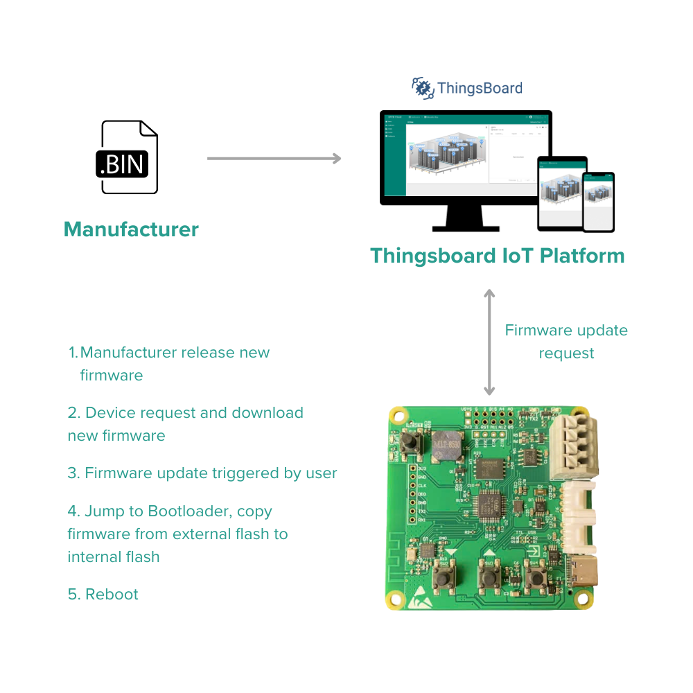
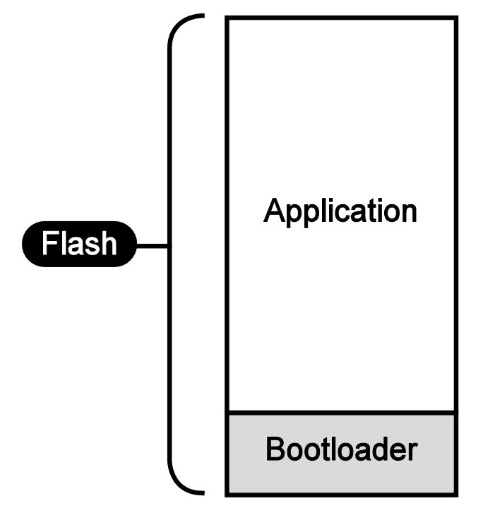
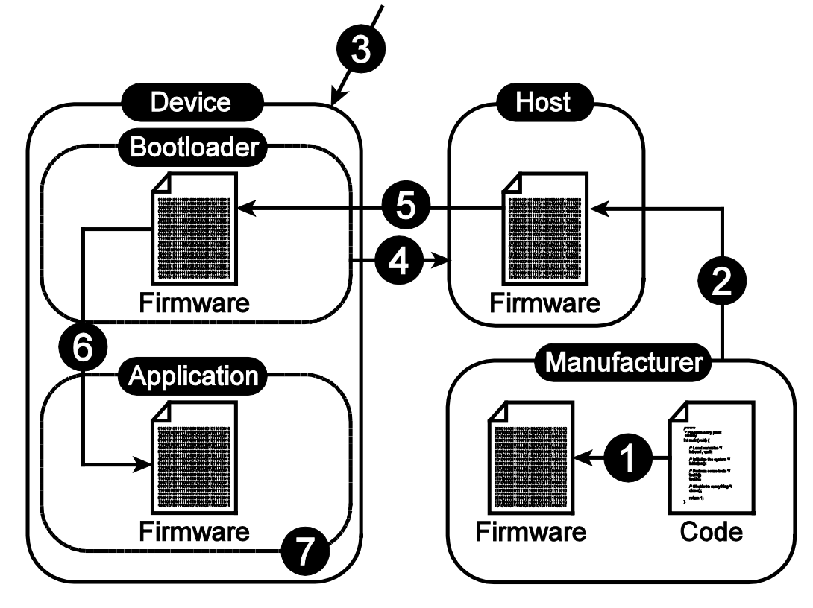
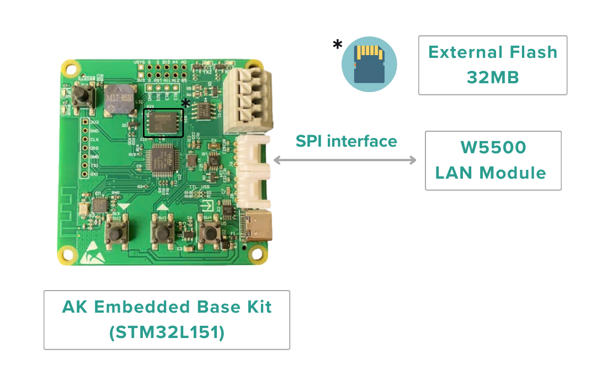
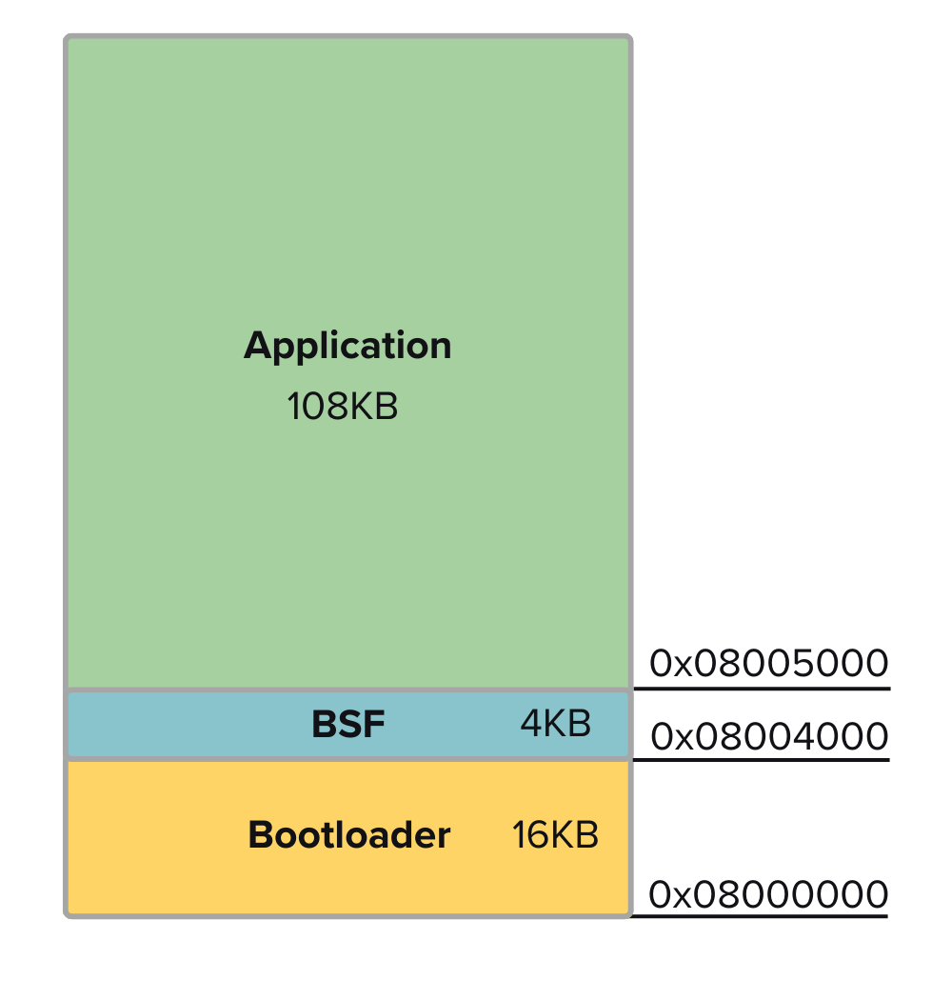
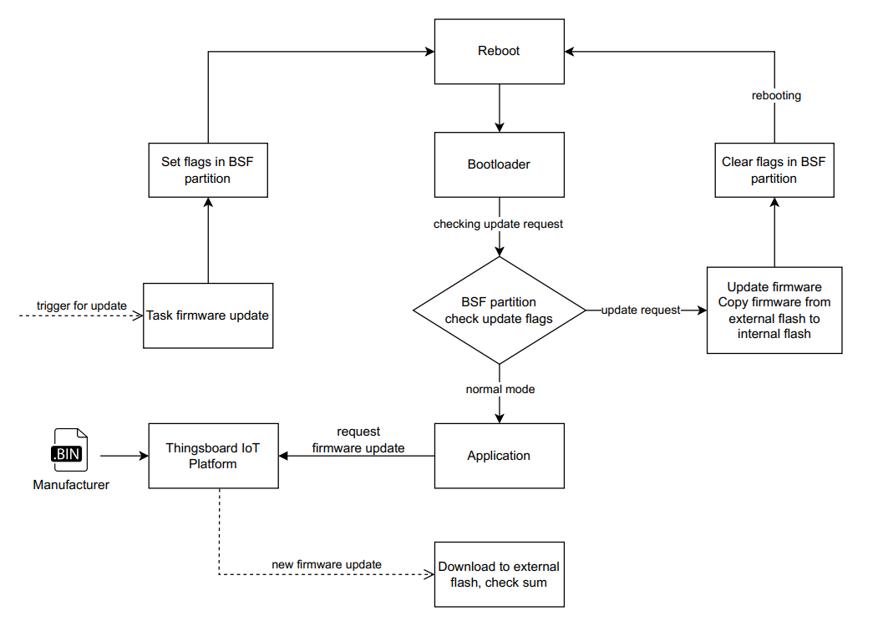

## FOTA - Firmware Update Over The Air

In product development, updating device software is a very important feature. Updating device software helps manufacturers fix device errors (if any) because during the product development process there will be unforeseen errors, or upgrade new features for users. In electronic products that use microcontrollers, program updates become more flexible thanks to reprogrammable memory (Flash). Flash is where the device's firmware is stored.

In this article, we will present the process of updating firmware for remote devices via internet connection, helping users to easily update applications locally.

### 1. Firmware Update Concept
### The bootloader

Unlike traditional programming, we only save the application that needs to be run to the default partition in Flash memory. Instead, we will divide Flash memory into two main partitions: **Bootloader** and **Application**.

In there: 
- **Application:** where the main application runs
- **Bootloader:** is the first program when the application runs, it will check for software update changes and can update the firmware for the Application. Bootloaders are often designed with the smallest possible amount of memory.

### Update process

The firmware update process is usually performed with the following steps:
1. Manufacturer releases new firmware version
2. New firmware is distributed to users
3. User confirms update
4. Bootloader connects to the server
5. The server sends new firmware to the device
6. Update the new application to replace the current application
7. Launch the new application

### 2. Implement on AK Embedded Base Kit
### Hardware

Hardware includes:
- **AK Embedded Base Kit:** includes STM32L151, Buzzer, Button, OLED, LCD,... and 32MB **external flash** (used for storage for various user purposes, in this application is used as a set remember to cache new firmware for KIT when a firmware update is requested).
- **LAN module W5500:** used to connect to the internet for KIT.

### Memory map

The microcontroller's Flash memory is organized with partitions as follows:
- [0x08000000]: **Boot** - Where to store the first program when MCU starts
- [0x08004000]: **BSF** - Data sharing partition between Boot and Application
- [0x08005000]: **Application** - Contains the device's main application

The application's startup sequence is as follows: upon startup, the application will first run the **Bootloader** partition and read the flags in the **BSF** partition. If there is no firmware update request, it will jump into the **Application** partition to run the application. This will then reset the flags in the BSF.

### Update process

The steps are performed as follows:
1. The manufacturer releases a new firmware and adds it to the device group that needs to be updated on the web of the Thingsboard IoT platform.
2. Every time it is connected to the internet, AK Embedded Base Kit will send request to the server to check if there is a new firmware version that needs updating. If so, it will download and save to **external flash** memory, check sum calculation.
3. When there is a request to update the firmware from the user, the system will set flags in the **BSF** partition, reboot to the **Bootloader** partition and copy firmware from external memory to the internal flash of the **Application** partition, reset the flags in BSF and request the system reboot.
4. Restart the system to run the new application.

### Reference
| Topic | Link |
| ------ | ------ |
| Blog & Tutorial | https://epcb.vn/blogs/ak-embedded-software |
| Safe and Secure Bootloader  | https://ww1.microchip.com/downloads/en/Appnotes/Atmel-42141-SAM-AT02333-Safe-and-Secure-Bootloader-Implementation-for-SAM3-4_Application-Note.pdf |
| Simple Tasker Kernel | https://github.com/NgoThanhNha/template-stk-stm32f030 |